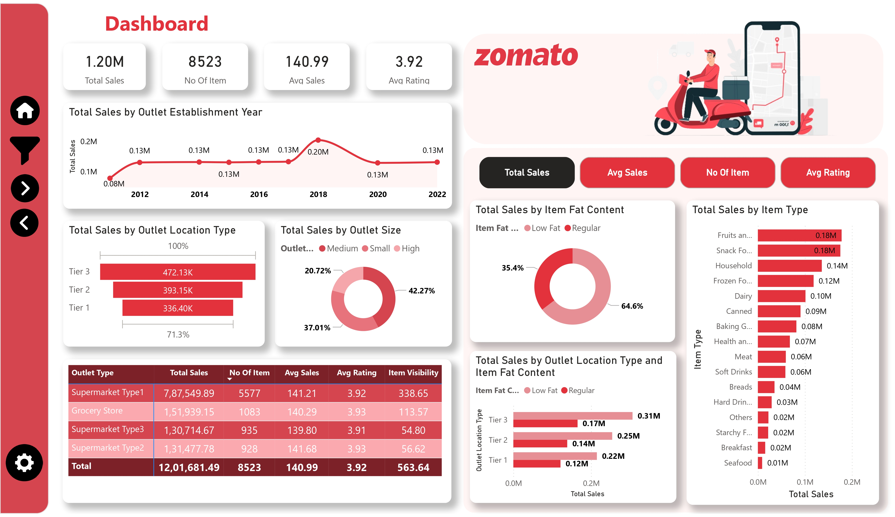

# 🍽️ Zomato Sales Performance Dashboard – Power BI Project

## 📌 Project Overview

This Power BI dashboard provides a comprehensive analysis of Zomato’s outlet performance, sales trends, and product-level insights.  
The objective is to monitor key KPIs, identify high-performing segments, and support data-driven business decisions.

---

## 🎯 Business Objectives

- Analyze total sales performance across outlet types and locations
- Identify top-performing item categories
- Evaluate impact of outlet size and establishment year on revenue
- Compare sales distribution based on item fat content
- Monitor average rating and item visibility impact

---

## 📊 Key Performance Indicators (KPIs)

| KPI | Value |
|-----|-------|
| 💰 Total Sales | 1.20M |
| 📦 Number of Items | 8,523 |
| 📈 Average Sales | 140.99 |
| ⭐ Average Rating | 3.92 |

---

## 📈 Dashboard Insights

### 1️⃣ Sales Trend by Outlet Establishment Year
- Peak sales observed in 2018 (0.20M)
- Stable sales trend from 2012–2022
- Older outlets contribute consistently to revenue

### 2️⃣ Sales by Outlet Location Type
- Tier 3 leads with 472.13K
- Tier 2 contributes 393.15K
- Tier 1 generates 336.40K

📌 Insight: Tier 3 locations are major revenue drivers.

---

### 3️⃣ Sales by Outlet Size
- High Size Outlets: 42.27%
- Medium Size Outlets: 37.01%
- Small Size Outlets: 20.72%

📌 Insight: Larger outlets generate significantly higher sales.

---

### 4️⃣ Sales by Item Fat Content
- Regular Items: 64.6%
- Low Fat Items: 35.4%

📌 Insight: Customers prefer regular items over low-fat alternatives.

---

### 5️⃣ Top Performing Item Categories

| Category | Sales |
|----------|-------|
| Fruits & Vegetables | 0.18M |
| Snack Foods | 0.18M |
| Household | 0.14M |
| Frozen Foods | 0.12M |
| Dairy | 0.10M |

📌 Insight: Fresh and snack categories dominate revenue contribution.

---

### 6️⃣ Outlet Type Performance

| Outlet Type | Total Sales |
|-------------|-------------|
| Supermarket Type1 | 787,549.89 |
| Grocery Store | 151,939.15 |
| Supermarket Type2 | 131,477.78 |
| Supermarket Type3 | 130,714.67 |

📌 Insight: Supermarket Type1 is the highest revenue contributor.

---

## 🛠️ Tools & Technologies Used

- Power BI
- DAX (Data Analysis Expressions)
- Data Modeling
- Data Cleaning & Transformation

---

## 📂 Files Included

- `Zomato_Sales_Dashboard.pbix`
- Dataset (Sample CSV)
- Dashboard Screenshot
- README.md

---

## 🖼️ Dashboard Preview

---

## 🚀 Business Impact

This dashboard enables:

✔ Performance monitoring across locations  
✔ Strategic expansion planning  
✔ Product category optimization  
✔ Data-driven marketing decisions  
✔ Revenue growth strategy formulation  

---

## 📬 Contact

If you would like access to the PBIX file or have any suggestions, feel free to connect.

---

⭐ If you found this project useful, consider giving it a star!
